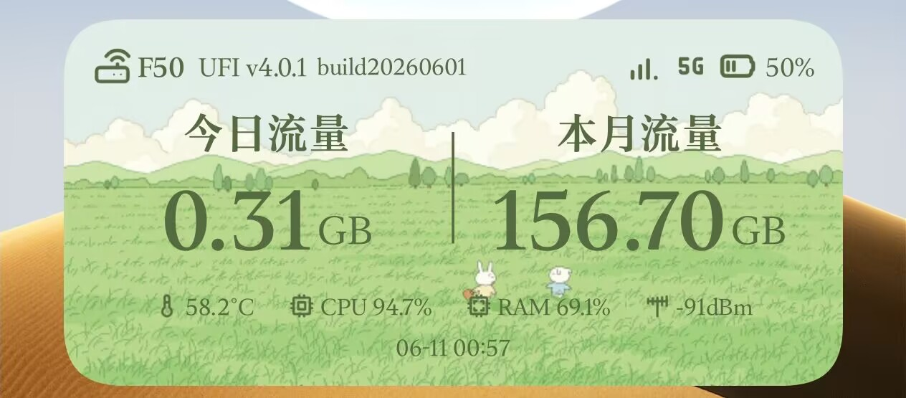
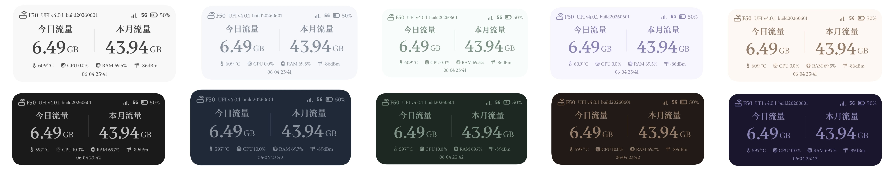
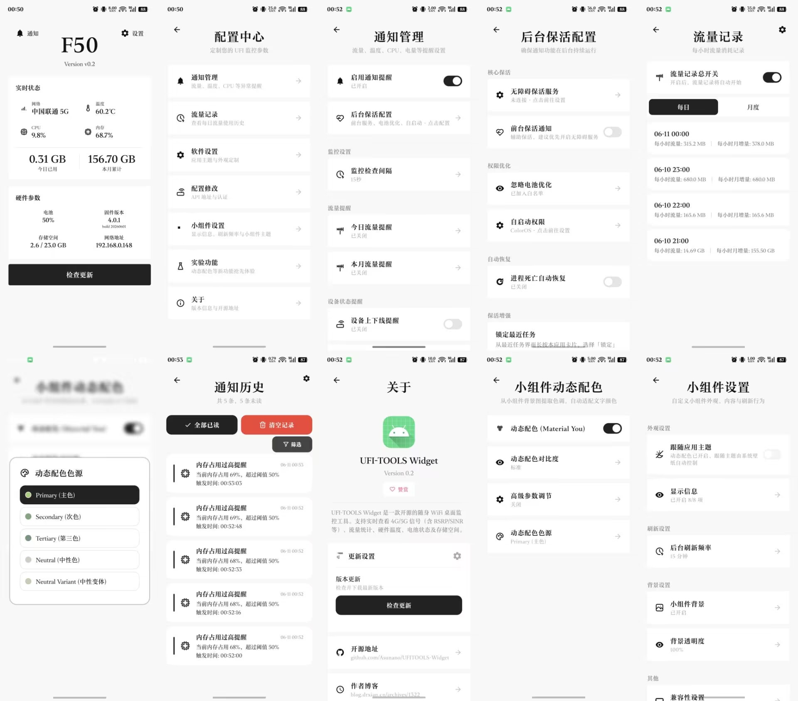

# UFI-TOOLS Widget

<p align="center">
  
  
  
  
  
</p>

<p align="center">
  <strong>专业的 Android 桌面小组件，实时监控随身 WiFi 设备状态</strong>
</p>

<p align="center">
  <a href="#功能特性">功能</a> •
  <a href="#技术架构">架构</a> •
  <a href="#快速开始">快速开始</a> •
  <a href="#技术栈">技术栈</a> •
  <a href="#FAQ">FAQ</a>
</p>
我的博客[UFITOOLS Widget：专为随身WiFi打造的Android桌面监控组件](https://blog.drxian.cn/archives/1322)

<p align="center">
  
</p>

---

## 项目简介

**UFI-TOOLS Widget** 是基于 **UFI-TOOLS API** 开发的 Android 桌面小组件应用，用于实时监控随身 WiFi 设备（F50、U30 Air 等）的运行状态。

### 核心价值

- **实时性**：5 秒级数据刷新，支持前台实时刷新 + 后台定时采集，可自定义间隔
- **保活性**：五层保活架构，确保通知功能 24/7 正常运行
- **专业性**：完整的数据采集协议（HTTP REST API + Kano 签名认证 + AT 指令透传）
- **美观性**：Material Design + 动态配色 + 自定义背景
- **智能性**：7 种警报类型 + 智能防抖 + 持久化历史记录

### 为什么选择 UFI-TOOLS Widget？

| 优势 | 说明 |
|------|------|
| **极致实时** | 5 秒级刷新，可自定义间隔 |
| **永不掉线** | 五层保活架构，适配国产 ROM后台限制  |
| **专业协议** | 完整实现 UFI-TOOLS API + AT 指令透传 |
| **极致美观** | Material You 动态配色 + 10 种预设主题 + 自定义背景 |
| **智能警报** | 7 种警报类型 + 智能防抖，避免通知风暴 |
| **完全离线** | 所有数据本地存储，无需联网，保护隐私 |

---

## 核心亮点

### 1. 专业的数据采集引擎

避免设备 CPU 飙高，确保读数准确性。

- **两阶段采集策略**：串行采集 CPU 基准值 → 并发采集其他数据（避免设备 CPU 飙高）
- **AT 指令透传**：支持展锐/Quectel 双平台，10+ 路并发 AT 请求
- **3GPP 信号换算**：LTE/NR 双制式，智能 RAT 检测
- **协议自动探测**：HTTPS/HTTP 自动切换，私有 IP 跳过探测（减少延迟）
- **多级缓存**：1 小时 TTL 缓存 + 永久缓存（月流量/芯片平台），减少 API 请求

**性能数据**：

- 完整采集耗时：~3-5 秒（含 2 秒冷却）
- 轻量采集耗时：~0.5 秒（仅 `/api/baseDeviceInfo`）
- 并发 AT 请求：10-13 路（内部线程池）

### 2. 五层保活架构

单一保活手段在国产 ROM 上不可靠，多层冗余确保 24/7 运行。

| 层级 | 机制 | 穿透能力 | 功耗 |
|------|------|----------|------|
| 第一层 | NotificationMonitor 协程轮询 | 独立进程，15-600s 间隔 | 极低 |
| 第二层 | 前台服务 + PartialWakeLock | 防止 CPU 休眠 | 低 |
| 第三层 | AlarmReceiver (setAlarmClock) | **穿透 Doze 模式** | 极低 |
| 第四层 | WorkManager 周期任务 | 系统级持久化 | 低 |
| 第五层 | 无障碍服务 | 提高进程优先级 | 极低 |


### 3. 智能通知警报

避免"通知风暴"，智能防抖 + 持久化历史。

- **7 种警报类型**：流量/温度/CPU/内存/电池/设备上下线
- **智能防抖**：动态间隔 + 原子操作 + 时间戳隔离
- **国产 ROM 适配**：自动检测通知渠道降级（ColorOS/MIUI/EMUI）
- **警报历史**：Room 持久化 + 分页浏览 + 滑动操作
- **全屏意图**：`setFullScreenIntent()` 强制弹出横幅通知，确保国产 ROM 不被降级为静默通知

### 4. 完善的错误处理

优雅降级，自动恢复，避免崩溃。

- **三种错误分类**：网络错误 / API 错误 / 通用错误
- **TCP 可达性检测**：1 秒超时，快速判断设备离线
- **两级失败计数器**：网络失败 2 次 / API 失败 3 次 → 自动停止
- **崩溃恢复**：独立进程捕获异常，下次启动弹窗展示
- **重试机制**：`Result.retry()`（非 `failure()`），确保 ping 恢复后自动解除

---

## 功能特性


### 桌面小组件 (4×2)

桌面直接展示设备核心状态，无需打开应用。

**布局设计**

```
┌────────────────────────────────┐
│ 设备型号    信号格 网络制式  80% │  ← 第一行：头部状态栏
├──────────────────┬───────────────────┤
│   今日 1.2GB  │  本月 23.5GB  │  ← 第二行：流量核心展示区
├──────────────────┴───────────────────┤
│ 45°C  23%  67%  -85dBm  │  ← 第三行：硬件状态缩略行
├────────────────────────────────┤
│       2026-07-06 01:12:33        │  ← 第四行：最后更新时间
└────────────────────────────────┘
```

<p align="center">
  
</p>

**配置项**

通过「小组件设置」页面调整：

- **显示项开关**（8 项可独立控制）：流量、温度、型号、信号、电池、CPU、内存、更新时间
- **小组件主题**：跟随应用 / 强制浅色 / 强制深色
- **主题配色**：跟随应用配色 / 独立选择颜色主题索引
- **背景透明度**：0-100% 滑块调节
- **自定义背景图片**：从相册选择图片，支持裁剪适配
- **圆角裁剪**：20dp 圆角（可通过兜底开关关闭为直角）

**Material You 动态配色（Android 12+）**

从系统壁纸或小组件背景图提取色调，自动适配文字颜色：

- **对比度**：柔和 / 标准 / 强烈（三级可调）
- **色源选择**：Primary / Secondary / Tertiary / Neutral / NeutralVariant
- **高级设置**：浅色/深色模式独立调节背景亮度、文字亮度、饱和度增强

### 通知警报系统

**7 种警报类型**

| 类型 | 触发条件 | 默认阈值 | 阈值范围 |
|------|---------|---------|----------|
| 今日流量超限 | 日用量 >= 阈值 | 1 GB | 1-100 GB |
| 本月流量超限 | 月用量 >= 阈值 | 10 GB | 10-500 GB |
| 温度过高 | 温度 >= 阈值 | 70°C | 30-100°C |
| CPU 异常占用 | CPU 占用 >= 阈值 | 80% | 20-100% |
| 内存占用过高 | 内存占用 >= 阈值 | 90% | 50-100% |
| 电量过低 | 电量 <= 阈值 | 20% | 10-50% |
| 设备上下线 | 在线状态变化 | — | — |

**智能防抖机制**

防抖间隔动态读取用户设置的监控检查间隔（15-600 秒），每种类型独立维护最后通知时间戳。

**警报历史**

Room 数据库持久化存储所有警报记录：

- **分页浏览**：每页 10/20/50/100 条可调
- **类型筛选**：全部 / 日用量 / 月用量 / 温度 / CPU / 内存 / 电池 / 设备（8 种）
- **状态筛选**：全部 / 未读 / 已读
- **滑动操作**：右滑标记已读（绿色背景），左滑删除（红色背景）
- **自动清理**：最多保存 100/500/1000/不限条，超出后自动清理旧记录

---

## 界面预览

<p align="center">
  
</p>

---

## 技术架构

### 分层架构

```
┌─────────────────────────────────────────┐
│            UI 层（View）              │
│  MainActivity / Widget / Notification  │
├─────────────────────────────────────────┤
│         业务逻辑层（ViewModel）          │
│  MainViewModel / MonitorViewModel      │
├─────────────────────────────────────────┤
│        数据采集层（Repository）          │
│  DeviceRepository / ATRepository       │
├─────────────────────────────────────────┤
│       网络层（Network）                │
│  ApiService / OkHttp / KanoAuth       │
├─────────────────────────────────────────┤
│      本地存储层（Local）                │
│  Room / DataStore / File              │
└─────────────────────────────────────────┘
```

---

## 技术栈

- **语言**：Kotlin 2.0.21（100% Kotlin，0% Java）
- **架构**：MVVM + Repository + DataSource
- **异步**：Kotlin Coroutines + Flow
- **网络**：OkHttp 4.12.0 + 自定义 Kano 签名拦截器
- **数据库**：Room 2.7.1（SQLite 封装）
- **UI**：ViewBinding + Material Design 3 + Dynamic Colors
- **桌面小组件**：AppWidgetProvider + RemoteViews + WidgetBitmapCache
- **后台保活**：Foreground Service + AlarmManager + WorkManager + AccessibilityService
- **通知系统**：NotificationManagerCompat + 智能防抖算法
- **调试**：自定义 DebugLogger（内存 + 文件双写，敏感信息脱敏）
- **构建**：Gradle + AGP 8.7.3 + KSP
- **CI/CD**：GitHub Actions（并行 Job、Gradle 缓存、自动发布 Release）

---

## 项目结构

```
UFITOOLS-Widget/
├── app/
│   ├── src/main/
│   │   ├── java/com/example/ufitoolswidget/
│   │   │   ├── data/               # 数据层
│   │   │   │   ├── api/           # API 服务（UFI-TOOLS API 定义）
│   │   │   │   ├── repository/    # 数据仓库（DeviceRepository/ATRepository）
│   │   │   │   ├── local/         # 本地存储（Room/DataStore）
│   │   │   │   └── model/         # 数据模型（Request/Response）
│   │   │   ├── domain/            # 领域层（业务逻辑）
│   │   │   │   ├── usecase/       # 用例（采集/通知/保活）
│   │   │   │   └── model/         # 领域模型
│   │   │   ├── ui/                # UI 层
│   │   │   │   ├── main/          # 主界面（MainActivity/MainViewModel）
│   │   │   │   ├── widget/        # 小组件（UFIWidgetProvider/WidgetConfigActivity）
│   │   │   │   ├── notification/  # 通知管理（NotificationSettingsActivity）
│   │   │   │   ├── settings/      # 设置（SettingsActivity/SettingsViewModel）
│   │   │   │   └── about/         # 关于（AboutActivity）
│   │   │   ├── receiver/          # 广播接收器
│   │   │   │   ├── AlarmReceiver.kt         # 定时唤醒
│   │   │   │   ├── BootReceiver.kt          # 开机自启
│   │   │   │   └── NetworkReceiver.kt       # 网络变化监听
│   │   │   ├── service/           # 服务
│   │   │   │   ├── ForegroundService.kt     # 前台服务
│   │   │   │   ├── NotificationMonitor.kt   # 通知监听（独立进程）
│   │   │   │   └── KeepAliveService.kt     # 保活服务
│   │   │   ├── worker/            # WorkManager Worker
│   │   │   │   └── PeriodicWorker.kt        # 周期任务
│   │   │   ├── utils/             # 工具类
│   │   │   │   ├── KanoAuth.kt            # Kano 签名认证
│   │   │   │   ├── ATCommandParser.kt      # AT 指令解析
│   │   │   │   ├── SignalQualityCalculator.kt # 信号质量计算
│   │   │   │   ├── NotificationHelper.kt    # 通知助手
│   │   │   │   ├── KeepAliveManager.kt     # 保活管理器
│   │   │   │   ├── DebugLogger.kt          # 调试日志
│   │   │   │   └── WidgetBitmapCache.kt    # 小组件位图缓存
│   │   │   └── UFIApplication.kt          # Application 类
│   │   ├── res/                   # 资源文件
│   │   │   ├── layout/           # 布局 XML
│   │   │   ├── values/           # 值资源（colors/strings/dimens）
│   │   │   ├── drawable/         # 矢量图
│   │   │   └── xml/             # 小组件配置
│   │   └── AndroidManifest.xml
│   └── build.gradle.kts
├── gradle/
├── build.gradle.kts
├── settings.gradle.kts
└── README.md
```

---

## 使用方法

### 快速开始

1. 从 [Releases](https://github.com/Asunano/UFITOOLS-Widget/releases) 下载最新 APK 安装
2. 确保手机已连接随身 WiFi 设备的 WiFi 网络
3. 打开应用，在首次配置向导中填写设备地址和管理口令（默认 `192.168.0.1:2333` / `admin`）
4. 应用自动探测协议并同步设备信息
5. 回到桌面，长按添加「UFI 状态 (4x2)」小组件

### 通知功能配置

1. 进入「设置」→「通知管理」，开启通知总开关
2. 根据需要启用各类警报（流量/温度/CPU/内存/电量/设备在线），设置触发阈值
3. 调整监控检查间隔（15-600 秒）
4. 进入「后台保活配置」，按需开启前台保活通知、电池优化白名单、自启动权限等
5. 建议同时启用无障碍保活服务和周期性 Worker，构建多层保活

### 小组件配置

1. 长按桌面小组件 → 编辑 → 进入「小组件设置」
2. 调整显示项开关（流量/温度/型号/信号/电池/CPU/内存/时间）
3. 选择小组件主题和配色
4. 可选：设置自定义背景图片、调整透明度

---

## 常见问题 FAQ

### 为什么需要五层保活架构？

**答**：Android 系统（尤其是国产 ROM）会在后台限制应用运行。单一保活手段（如前台服务）在 Doze 模式或系统清理后会失效。五层架构通过**冗余设计**确保至少一层能唤醒应用。

### 应用会影响设备性能吗？

**答**：不会。数据采集在**独立线程**执行，两阶段采集策略避免并发导致设备 CPU 飙高。轻量轮询模式（NotificationMonitor）性能开销仅为完整采集的 1/6~1/10。

### 为什么需要电池优化白名单？

**答**：Android 6.0+ 引入 Doze 模式，会限制后台应用。添加到电池优化白名单后，应用可以在后台正常运行（但仍然受 Doze 模式限制，因此需要第三层 AlarmReceiver 穿透 Doze）。

### 支持哪些 UFI 设备？

**答**：任何运行 UFI-TOOLS 固件的随身 WiFi 设备，包括但不限于：
- F50
- U30 Air
- 其他基于 UFI-TOOLS 的设备

---


## 安全说明

### 认证安全

- **Token 哈希存储**：用户 Token 使用 SHA256 哈希存储，不保存明文
- **ThreadLocal 缓存**：`MessageDigest`/`Mac` 实例使用 `ThreadLocal` 缓存，避免密钥泄露

### 数据安全

- **敏感信息脱敏**：调试日志自动脱敏（IP/IMEI/Token/Authorization）
- **本地存储**：所有数据仅存储在本地设备，不上传云端
- **HTTP API**：支持 HTTPS 协议（自动探测）

### 权限安全

- **最小权限原则**：仅申请必要权限
- **通知权限**：可选开启，无权限时仍然记录到警报历史
- **无障碍服务**：仅用于保活，不执行任何无障碍操作

---

## 调试与诊断

### 调试模式

关于页连续点击版本号 5 次（1.5 秒超时窗口）激活调试模式。

### 调试日志

- 内存最多 800 条 + 文件持久化（3MB 上限截断）
- 自动落盘阈值 20 条
- 5 种分类（API/数据、UI 渲染、系统、生命周期、异常）
- 敏感信息脱敏（IP/IMEI/Token/Authorization）
- 线程安全

### 全量诊断报告

系统信息 + UI 视图快照 + 分类统计 + 最近 50 条 API/30 条 UI/20 条异常日志 + API 连接状态。

通过 FileProvider 分享诊断文件（`ufitools_diagnostic.txt`）。

### 崩溃处理

`CrashHandler` 独立进程（`:crash_handler`）捕获未处理异常，下次启动弹窗展示。

---

## 贡献指南

### 提交 Issue

- 使用 Issue 模板
- 提供详细复现步骤
- 附上调试日志

### 提交 Pull Request

1. Fork 本仓库
2. 创建特性分支 (`git checkout -b feature/AmazingFeature`)
3. 提交更改 (`git commit -m 'Add some AmazingFeature'`)
4. 推送到分支 (`git push origin feature/AmazingFeature`)
5. 创建 Pull Request

### 代码规范

- 遵循 Kotlin 官方代码规范
- 使用 ktlint + detekt 进行代码检查
- 提交信息遵循 Conventional Commits

---

## 许可证

本项目采用 MIT 许可证。详见 [LICENSE](LICENSE) 文件。

---

## 赞助支持

如果这个项目对您有帮助，欢迎赞助支持！

<p align="center">
  
  
</p>

---

## 更新日志

详见 [CHANGELOG.md](CHANGELOG.md)。

---

<p align="center">
  ⭐ 如果这个项目对你有帮助，请给它一个 Star！⭐
</p>
